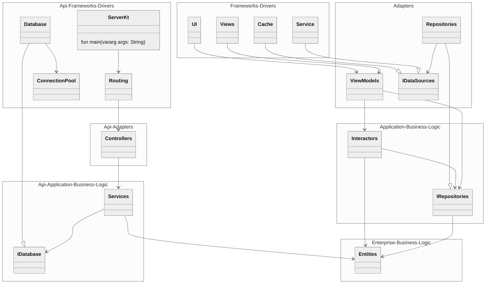
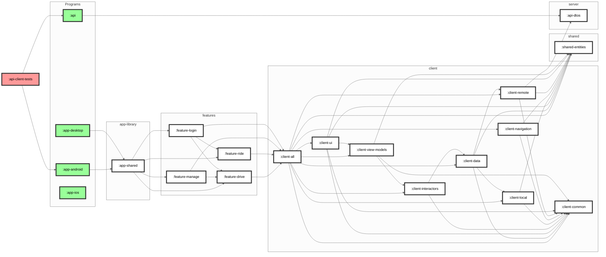

# XYZ
Get your X from Y to Z

## Roles
* Passengers - Individuals, Groups, or Wards taking a trip.
* Providers - Owners or Operators providing the service.
* Managers - Fleet Managers or Dispatchers managing the service.

## Features
* [Manage](./feature-manage/README.md)
* [Drive](./feature-drive/README.md)
* [Ride](./feature-ride/README.md)

## Contributing

To get started, you'll need to first set up some credentials for the app by ensuring you have the following files with the given variables.

### Environment Variables and Secrets
- `./local.properties` - Usually generated by Android Studio and contains a path to the Android SDK.
- `./secrets.properties` - This will need to be created in the root of the project.
  - MAPS_API_KEY
  - AD_MOB_APP_ID
  - APP_LOVIN_API_KEY
- `./local.defaults.properties` - defines defaults for the above, checked in VC. Used by :app-android secrets task
- `./stripe-secrets.properties` - This will need to be created in the root of the project.
  - STRIPE_API_KEY_TEST
  - STRIPE_API_KEY_LIVE
  - STRIPE_STAGING_URL
  - STRIPE_PRODUCTION_URL
- `./stripe-local.defaults.properties` - defines defaults for the above, checked in VC
- `~/.gradle/gradle.properties` - user global gradle properties
- `./gradle.properties` - project gradle properties

## Architecture

### Client and Server Layer Comparison
The client-side applications are following typical Android MVVM and Repository patterns within a 4-layer Clean Architecture, while the server-side applications are following an Express.js-derived pattern usually considered MVC, though we attempt to remain reactive, mapping any information to a higher abstraction before passing it to a higher layer of abstraction(here lower) and mapping the results back, instead of injecting output ports that would allow the model to directly control the output.

### Modularization

