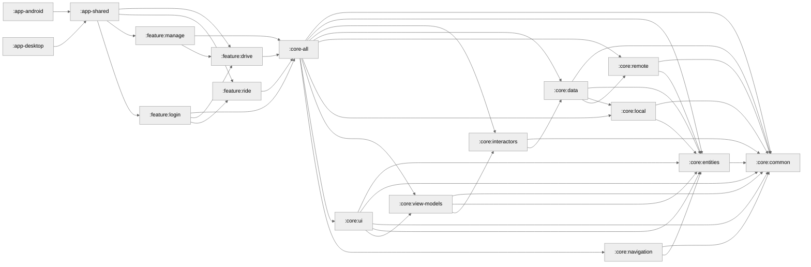

# XYZ
Get your X from Y to Z

## Users
* Riders - Individuals, Groups, or Wards
* Drivers - Owners or Operators

## Features
* [Manage](./feature/manage/README.md)
* [Drive](./feature/drive/README.md)
* [Ride](./feature/ride/README.md)

## Modularization

