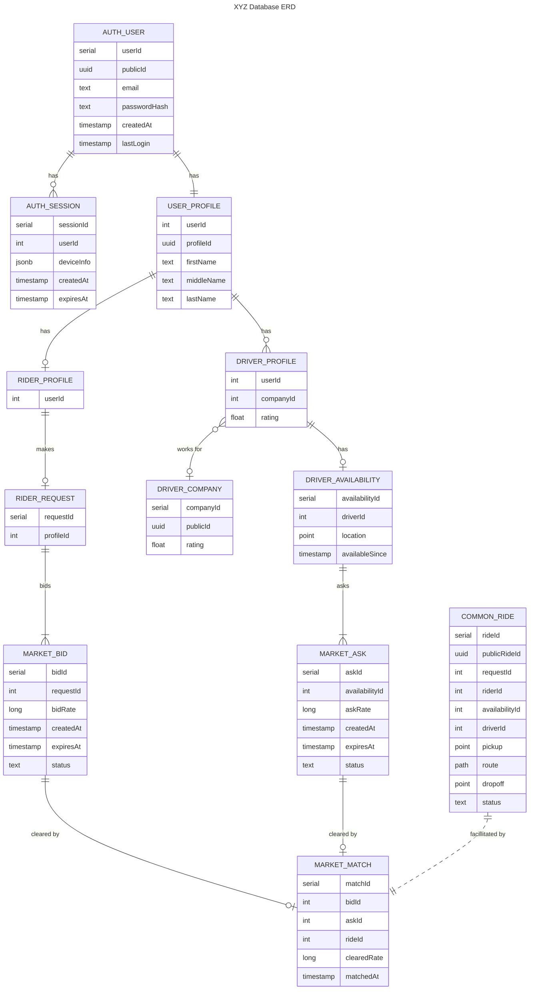

# Entity Relationship Diagram

```mermaid
---
title: XYZ Database ERD
---

erDiagram
  AUTH_USER {
    serial userId
    uuid publicId
    text email
    text passwordHash
    timestamp createdAt
    timestamp lastLogin
  }
  AUTH_USER ||--o{ AUTH_SESSION : has
  AUTH_SESSION {
    serial sessionId
    int userId
    jsonb deviceInfo
    timestamp createdAt
    timestamp expiresAt
  }

  AUTH_USER ||--|| USER_PROFILE : has
  USER_PROFILE {
    int userId
    uuid profileId
    text firstName
    text middleName
    text lastName
  }

  USER_PROFILE ||--o| RIDER_PROFILE : has
  RIDER_PROFILE {
    int userId
    
  }
  RIDER_PROFILE ||--o| RIDER_REQUEST : makes
  RIDER_REQUEST {
    serial requestId
    int profileId
  }

  DRIVER_COMPANY {
    serial companyId
    uuid publicId
    float rating
  }
  USER_PROFILE ||--o{ DRIVER_PROFILE : has
  DRIVER_PROFILE }o--o| DRIVER_COMPANY : "works for"
  DRIVER_PROFILE {
    int userId
    int companyId
    float rating
  }

  DRIVER_PROFILE ||--o| DRIVER_AVAILABILITY : has
  DRIVER_AVAILABILITY {
    serial availabilityId
    int driverId
    point location
    timestamp availableSince
  }

  RIDER_REQUEST ||--|{ MARKET_BID : bids
  MARKET_BID {
    serial bidId
    int requestId
    long bidRate
    timestamp createdAt
    timestamp expiresAt
    text status
  }

  DRIVER_AVAILABILITY ||--|{ MARKET_ASK : asks
  MARKET_ASK {
    serial askId
    int availabilityId
    long askRate
    timestamp createdAt
    timestamp expiresAt
    text status
  }

  MARKET_BID ||--o| MARKET_MATCH : "cleared by"
  MARKET_ASK ||--o| MARKET_MATCH : "cleared by"
  MARKET_MATCH {
    serial matchId
    int bidId
    int askId
    int rideId
    long clearedRate
    timestamp matchedAt
  }

  COMMON_RIDE ||..|| MARKET_MATCH : "facillitated by"
  COMMON_RIDE {
    serial rideId
    uuid publicRideId
    int requestId
    int riderId
    int availabilityId
    int driverId
    point pickup
    path route
    point dropoff
    text status
  }
```
