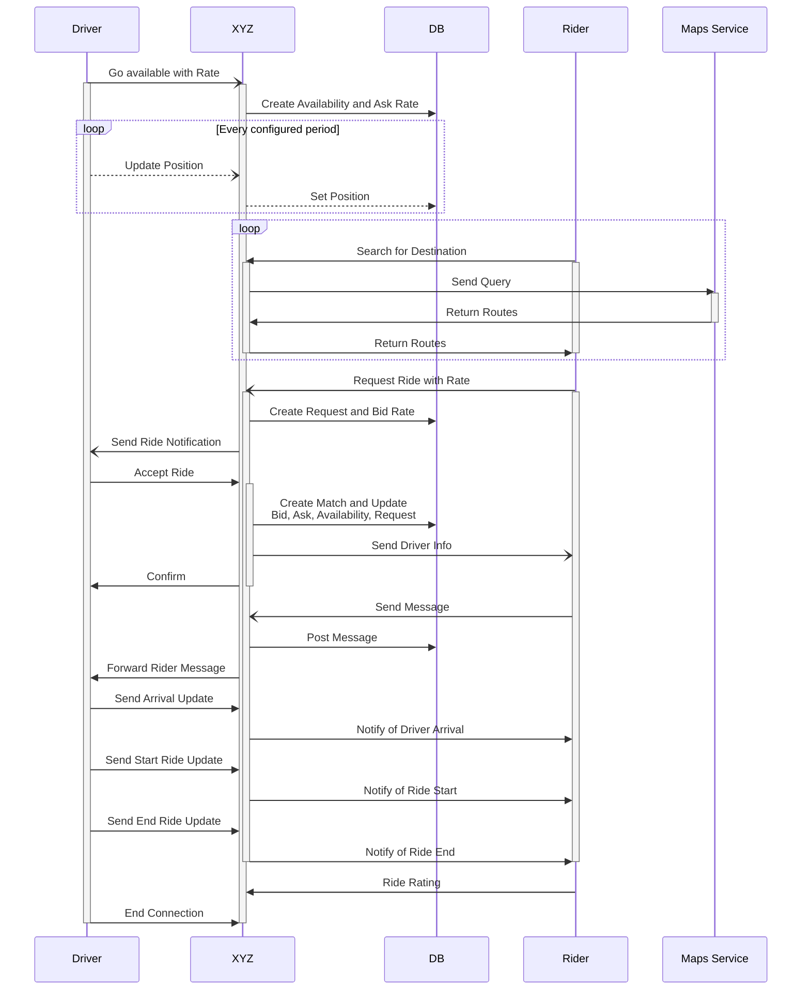

# Ride Sequence

```mermaid

sequenceDiagram
    participant Driver
    participant XYZ
    participant DB
    participant Rider
    participant Map as Maps Service

    Driver-)XYZ: Go available with Rate
    activate Driver
    activate XYZ
    XYZ->>DB: Create Availability and Ask Rate
    loop Every configured period
        Driver--)XYZ: Update Position
        XYZ-->>DB: Set Position
    end

    loop
        Rider->>XYZ: Search for Destination
        activate Rider
        activate XYZ
        XYZ->>Map: Send Query
        activate Map
        Map->>XYZ: Return Routes
        deactivate Map
        XYZ->>Rider: Return Routes
        deactivate Rider
        deactivate XYZ
    end
    Rider-)XYZ: Request Ride with Rate
    activate Rider
    activate XYZ
    XYZ->>DB: Create Request and Bid Rate

    
    XYZ-)Driver: Send Ride Notification
    Driver->>XYZ: Accept Ride
    activate XYZ
    XYZ->>DB: Create Match and Update<br>Bid, Ask, Availability, Request
    XYZ-)Rider: Send Driver Info
    XYZ->>Driver: Confirm
    deactivate XYZ

    Rider-)XYZ: Send Message
    XYZ->>DB: Post Message
    XYZ->>Driver: Forward Rider Message

    Driver->>XYZ: Send Arrival Update
    XYZ->>Rider: Notify of Driver Arrival
    Driver->>XYZ: Send Start Ride Update
    XYZ->>Rider: Notify of Ride Start
    Driver->>XYZ: Send End Ride Update
    XYZ->>Rider: Notify of Ride End
    deactivate Rider
    deactivate XYZ

    Rider->>XYZ: Ride Rating

    Driver->>XYZ: End Connection
    deactivate Driver
    deactivate XYZ

```