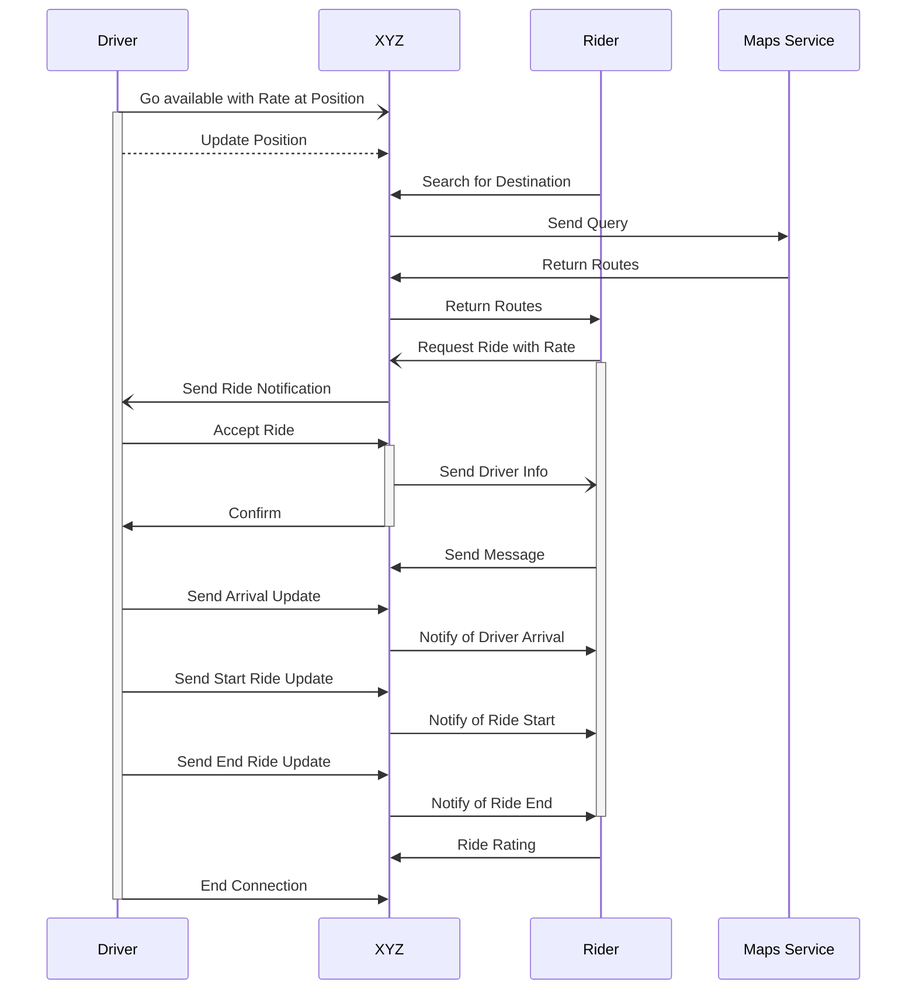

# Ride Sequence

```mermaid

sequenceDiagram
    participant Driver
    participant XYZ
    participant Rider
    participant Map as Maps Service

    Driver-)XYZ: Go available with Rate at Position
    activate Driver
    Driver-->>XYZ: Update Position

    Rider->>XYZ: Search for Destination
    XYZ->>Map: Send Query
    Map->>XYZ: Return Routes
    XYZ->>Rider: Return Routes
    Rider-)XYZ: Request Ride with Rate
    activate Rider

    
    XYZ-)Driver: Send Ride Notification
    Driver->>XYZ: Accept Ride
    activate XYZ
    XYZ-)Rider: Send Driver Info
    XYZ->>Driver: Confirm
    deactivate XYZ

    Rider->>XYZ: Send Message

    Driver->>XYZ: Send Arrival Update
    XYZ->>Rider: Notify of Driver Arrival
    Driver->>XYZ: Send Start Ride Update
    XYZ->>Rider: Notify of Ride Start
    Driver->>XYZ: Send End Ride Update
    XYZ->>Rider: Notify of Ride End
    deactivate Rider
    
    Rider->>XYZ: Ride Rating

    Driver->>XYZ: End Connection
    deactivate Driver

```