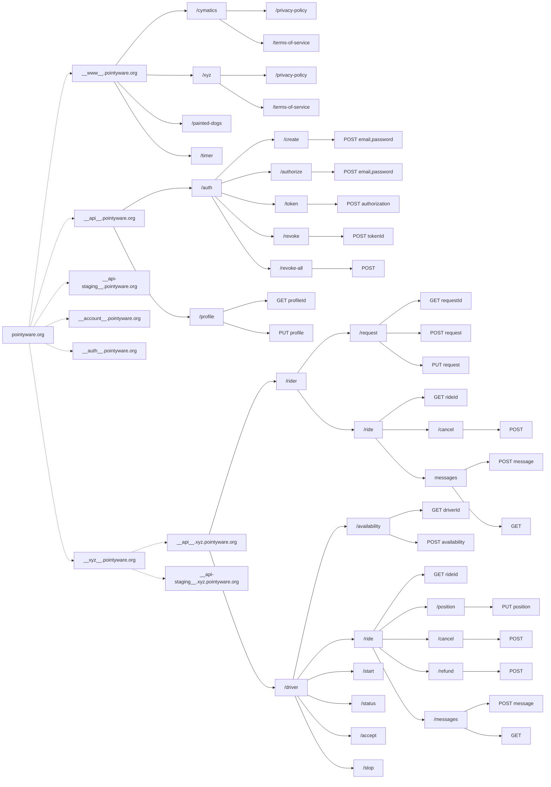

# XYZ Sitemap

```mermaid

flowchart LR
    top-level-domain["pointyware.org"]
    top-level-domain -.-> pointyware-site["__www__.pointyware.org"]
    
    pointyware-site --> pointyware-site-cymatics["/cymatics"] 
    pointyware-site-cymatics --> pointyware-site-cymatics-privacy["/privacy-policy"]
    pointyware-site-cymatics --> pointyware-site-cymatics-terms["/terms-of-service"]
    
    pointyware-site --> pointyware-site-xyz["/xyz"]
    pointyware-site-xyz --> pointyware-site-xyz-privacy["/privacy-policy"]
    pointyware-site-xyz --> pointyware-site-xyz-terms["/terms-of-service"]
    
    pointyware-site --> pointyware-site-paintedDogs["/painted-dogs"]
    pointyware-site --> pointyware-site-timer["/timer"]
    
    top-level-domain -.-> pointyware-api["__api__.pointyware.org"]
    top-level-domain -.-> pointyware-api-staging["__api-staging__.pointyware.org"]
    top-level-domain -.-> pointyware-api-alt1["__account__.pointyware.org"]
    top-level-domain -.-> pointyware-api-alt2["__auth__.pointyware.org"]
    
    pointyware-api --> pointyware-api-auth["/auth"]
    pointyware-api-auth --> pointyware-api-auth-create["/create"]
    pointyware-api-auth-create --> pointyware-api-auth-create-post["POST email,password"]
    pointyware-api-auth --> pointyware-api-auth-authorize["/authorize"] --> pointyware-api-auth-authorize-post["POST email,password"]
    pointyware-api-auth --> pointyware-api-auth-token["/token"] --> pointyware-api-auth-token-post["POST authorization"]
    pointyware-api-auth --> pointyware-api-auth-revoke["/revoke"] --> pointyware-api-auth-revoke-post["POST tokenId"]
    pointyware-api-auth --> pointyware-api-auth-revoke-all["/revoke-all"] --> pointyware-api-auth-revoke-all-post["POST"]
    
    pointyware-api --> pointyware-api-profile["/profile"]
    pointyware-api-profile --> pointyware-api-profile-get["GET profileId"]
    pointyware-api-profile --> pointyware-api-profile-put["PUT profile"]

    top-level-domain -.-> xyz-site["__xyz__.pointyware.org"]
    xyz-site -.-> xyz-api["__api__.xyz.pointyware.org"]
    xyz-site -.-> xyz-api-staging["__api-staging__.xyz.pointyware.org"]

    xyz-api --> xyz-api-rider["/rider"]
    xyz-api-rider --> xyz-api-rider-request["/request"]
    xyz-api-rider-request --> xyz-api-rider-request-get["GET requestId"]
    xyz-api-rider-request --> xyz-api-rider-request-post["POST request"]
    xyz-api-rider-request --> xyz-api-rider-request-put["PUT request"]
    xyz-api-rider --> xyz-api-rider-ride["/ride"]
    xyz-api-rider-ride --> xyz-api-rider-ride-get["GET rideId"]
    xyz-api-rider-ride --> xyz-api-rider-ride-cancel["/cancel"] --> xyz-api-rider-ride-cancle-post["POST"]
    xyz-api-rider-ride --> xyz-api-rider-ride-messages["messages"]
    xyz-api-rider-ride-messages --> xyz-api-rider-ride-messages-post["POST message"]
    xyz-api-rider-ride-messages --> xyz-api-rider-ride-messages-get["GET"]
    
    xyz-api --> xyz-api-driver["/driver"]
    xyz-api-driver --> xyz-api-driver-availability["/availability"]
    xyz-api-driver-availability --> xyz-api-driver-availability-get["GET driverId"]
    xyz-api-driver-availability --> xyz-api-driver-availability-post["POST availability"]
    xyz-api-driver --> xyz-api-driver-ride["/ride"]
    xyz-api-driver-ride --> xyz-api-driver-ride-get["GET rideId"]
    xyz-api-driver-ride --> xyz-api-driver-ride-position["/position"]
    xyz-api-driver-ride-position --> xyz-api-driver-ride-position-put["PUT position"]
    xyz-api-driver-ride --> xyz-api-driver-ride-cancel["/cancel"] --> xyz-api-driver-ride-cancel-post["POST"]
    xyz-api-driver-ride --> xyz-api-driver-ride-refund["/refund"]
    xyz-api-driver-ride-refund --> xyz-api-driver-ride-refund-post["POST"]
    xyz-api-driver --> xyz-api-driver-start["/start"]
    xyz-api-driver --> xyz-api-driver-status["/status"]
    xyz-api-driver --> xyz-api-driver-accept["/accept"]
    xyz-api-driver --> xyz-api-driver-stop["/stop"]
    xyz-api-driver-ride --> xyz-api-driver-ride-messages["/messages"]
    xyz-api-driver-ride-messages --> xyz-api-driver-ride-messages-post["POST message"]
    xyz-api-driver-ride-messages --> xyz-api-driver-ride-messages-get["GET"]
```
